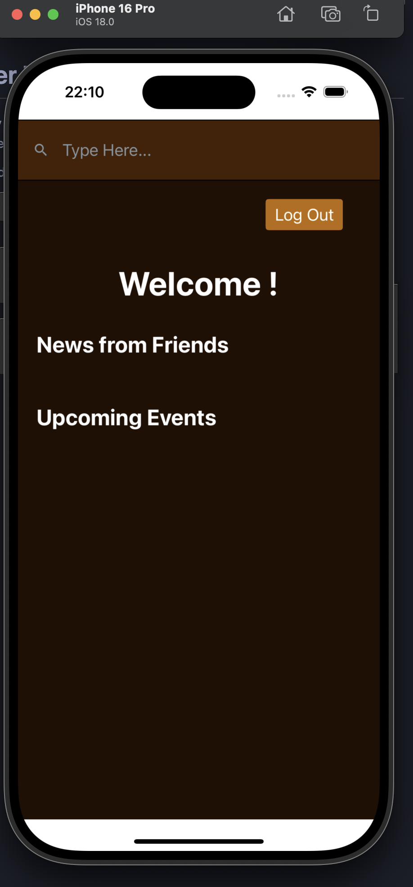

# Para correr la app:

- Tener el .env con el link donde este corriendo el backend, (explicacion en el readme general)

- Asegurarse de instalar todas las dependencias

- Correr la app con el simulador de ios

